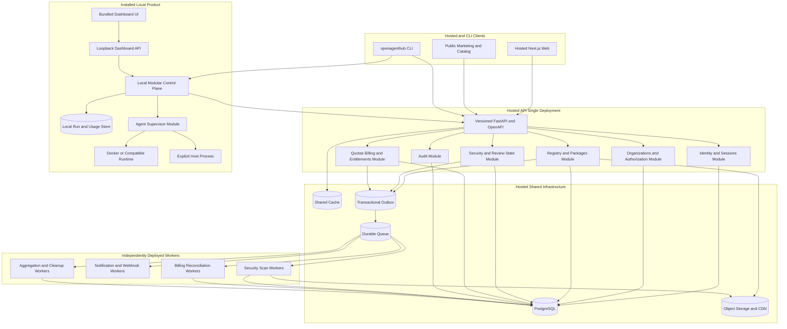

# Architecture reference

> Companion to [plan.md](../plan.md). Agents implementing any milestone must follow these boundaries.

## Target architecture

### Hosted modular-monolith boundaries

The hosted API is one deployment with explicit module ownership:

- **Identity and sessions** owns GitHub identity links, browser sessions, CLI device
  sessions, token issuance/revocation, and account status.
- **Organizations and authorization** owns organizations, memberships, teams, roles,
  namespace ACLs, package visibility policy, and reusable authorization decisions.
- **Registry and packages** owns namespaces/packages/versions, manifest metadata,
  publication orchestration, search/catalog queries, and archive references.
- **Security and review state** owns scan status, findings, manual review, quarantine,
  yank, and revocation state. Hostile scanning executes in worker deployments.
- **Quotas, billing, and entitlements** owns plan state, limits, reservations, usage
  accounting, and access entitlements. Payment-provider reconciliation executes in a
  worker.
- **Audit** owns the append-only audit-event contract and audit query policy.

Module rules:

1. Routers remain thin: parse/validate requests, call one application use case, and
   serialize the response.
2. Business rules live in domain/application modules, not FastAPI routes, Next.js
   handlers, CLI commands, SQLAlchemy models, or worker entrypoints.
3. Each module owns repositories for its tables. Cross-module reads use explicit
   query/application interfaces; cross-module writes use use cases or domain events.
4. Shared utilities are limited to technical concerns such as database transactions,
   configuration, logging, time, IDs, cryptography primitives, and queue clients.
   Shared utility packages must not become an unowned collection of business logic.
5. API and worker entrypoints compose modules through dependency injection.
6. Core synchronous state transitions use PostgreSQL transactions. External calls and
   expensive work occur after commit through outbox-backed jobs.
7. Worker handlers are idempotent, retryable, versioned, and safe against duplicate
   delivery.
8. Every queue has bounded retries, backoff, timeout, dead-letter handling, and
   operational visibility.
9. The API does not wait synchronously for scanning, email, webhooks, billing
   providers, download aggregation, or cleanup.
10. PostgreSQL, Redis, queue, and object-storage details remain behind adapters so a
    future extraction does not require rewriting domain rules.

### Shared API contract

1. FastAPI/Pydantic is the source of truth for hosted request and response schemas.
2. Publish a versioned OpenAPI document in CI.
3. Generate or validate a shared TypeScript client package consumed by:
   - `sdk/src/registry.ts` and the CLI;
   - hosted web server/BFF code;
   - public catalog fetchers where appropriate.
4. Do not duplicate hosted API interfaces independently in the SDK and web.
5. Add contract-diff checks so breaking API changes require a new API version or
   compatibility layer.
6. Keep older supported CLI versions functional for a documented compatibility
   window.
7. Standardize errors, request IDs, pagination, idempotency keys, retry hints, and
   authentication challenges.
8. The browser BFF translates secure cookie sessions into API calls but cannot grant
   permissions the domain API would reject.

### Worker and event model

1. Insert domain state and an outbox record in the same PostgreSQL transaction.
2. A dispatcher publishes committed outbox events to the durable queue.
3. Workers acknowledge jobs only after idempotent completion is persisted.
4. Duplicate, delayed, and out-of-order delivery are expected and tested.
5. Job payloads carry stable IDs and schema versions, not secrets or full archive
   contents.
6. Workers fetch authorized inputs from object storage using workload identity or
   narrowly scoped credentials.
7. Worker result writes go through module-owned application/repository interfaces.
8. Scan workers use stronger isolation, resource quotas, and no broad production
   credentials because they process hostile packages.

### Local modular control plane

The control plane and dashboard are bundled together but remain logically separate:

- The control plane owns long-running process/container state, run records, atomic
  local configuration writes, and local API authentication.
- The dashboard is a client of the control plane. Next.js is not the source of truth
  for run lifecycle.
- The CLI may perform simple read-only or one-shot actions directly, but supervised
  runs and shared state go through the control plane.
- Local modules include daemon lifecycle, install state, policy/sandbox decisions,
  supervisor adapters, usage adapters, and local API presentation.
- Local modules communicate in process and use one transactional local store. They
  are not separately deployed services.
- Hosted and local APIs have different trust boundaries and credentials even when
  they share generated data types.

### Microservice extraction criteria

No hosted domain module becomes a network microservice merely to avoid code
duplication. Extraction requires:

1. measured independent scale or latency needs;
2. a stronger isolation or compliance boundary;
3. clear team ownership and on-call responsibility;
4. an independently versioned API/event contract;
5. an owned datastore or read model;
6. a migration and rollback plan;
7. tracing, service authentication, retries, and failure-mode tests;
8. evidence that extraction reduces more complexity than it adds.

The likely extraction order, if needed after M-8, is scanning, notifications/webhooks,
billing reconciliation, analytics, and search indexing. Identity, authorization,
registry metadata, and organization policy remain in the modular monolith until
there is a concrete reason to split them.

## Core data models

### Publisher and namespace data

- `PublisherAccount`
  - stable account ID;
  - GitHub subject ID and username;
  - verified email when available;
  - account status: `active | suspended | deleted`;
  - roles: publisher, reviewer, admin;
  - created, last-login, and suspension timestamps.
- `Organization`
  - organization ID, slug, display name, verification state;
  - owners and maintainers.
- `Namespace`
  - normalized name;
  - owner account or organization;
  - member ACL;
  - reserved-name and impersonation-review status.
- `SigningKey`
  - public key and fingerprint;
  - owner account or organization;
  - creation, expiration, revocation, and last-use timestamps;
  - optional label and rotation relationship.

### Package-version security data

- `AgentVersion`
  - immutable namespace, name, semantic version, archive digest, manifest, signer key;
  - publisher account;
  - scan status and structured findings;
  - manual review status;
  - reviewer, review timestamp, and review notes;
  - yanked/revoked status and reason;
  - publication and update timestamps.
- Existing version bytes, manifest, digest, and signature cannot be replaced.
- Metadata changes that affect install decisions produce an audit event.

### Local install and execution policy

- `InstalledAgent`
  - namespace, name, version, archive digest, signer fingerprint, source registry;
  - installation timestamp;
  - last-known publisher identity, scan status, and review status;
  - sandbox policy independent of registry trust;
  - granted permissions and secret references.
- `SandboxOverride`
  - exact package digest;
  - requested mode;
  - user-confirmation timestamp;
  - OpenAgentHub version that recorded the decision;
  - optional expiry;
  - invalidated automatically on update or revocation.

### Run record

- `RunRecord`
  - stable run ID;
  - package name, version, and digest;
  - interface and command;
  - sandbox mode and container image digest;
  - process or container ID;
  - requested and effective permissions;
  - start, health, stop, and completion timestamps;
  - exit code and termination reason;
  - model/provider identifiers;
  - token counters and exact/estimated cost;
  - log location and bounded retention metadata;
  - ports and health-check state.

### Usage and limits

- `UsageObservation`
  - provider, agent, model, session/run ID when available;
  - input, output, reasoning, and cache tokens;
  - exact or estimated cost, currency, and pricing-table version;
  - source adapter and adapter version;
  - observation time and freshness;
  - quality: `exact | estimated | manual | unavailable`.
- `LimitSnapshot`
  - provider, account label, plan;
  - zero or more independent windows;
  - each window has name, duration, used percentage, units, and reset time;
  - credits or balance where available;
  - source: `local | live | manual`;
  - observed, stale, and error timestamps;
  - no raw credential values.
